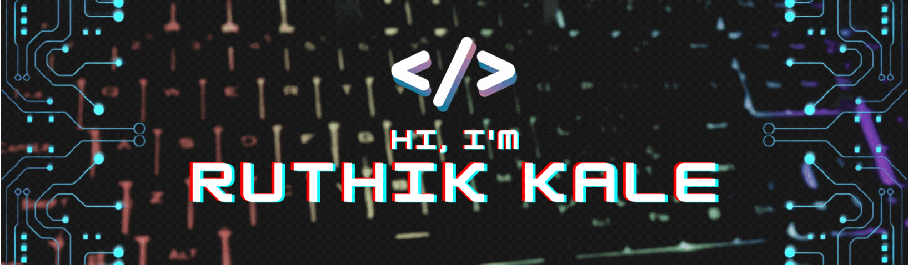

<!-- Profile views till now -->

  

# Welcome to My GitHub Profile!
<!--Banner added - created by using Canva -->

<!--Add readme-typing-svg - replace the below lines with it -->
<h3 align="center">A passionate Computer Science Geek</h3>

 <em>"I turn coffee into code!"</em> 

<!-- 
## About Me
I'm passionate about technology and constantly seeking opportunities to expand my knowledge and skills. With a background in [mention your field or area of expertise], I love working on diverse projects and exploring new technologies. I enjoy collaborating with like-minded individuals and contributing to open-source communities.

## What You'll Find Here
In my repositories, you'll find a wide range of projects, including but not limited to:

- **[Project Name 1](link-to-repo)**: A brief description of the project and its purpose.
- **[Project Name 2](link-to-repo)**: An overview of the project and its key features.
- **[Project Name 3](link-to-repo)**: How this project addresses a specific challenge and the solutions it offers.

I believe in continuous learning and improvement, so you might come across repositories that showcase my experiments, prototypes, and learning projects. Feel free to explore and provide feedback if you find anything interesting or have suggestions for improvement.

- 🔭 I’m currently working on **ML Model Building**

- 🌱 I’m currently learning **Data Science**

- 👯 I’m looking to collaborate on **Data Science Projects**

- 💬 Ask me about **Web Scrapping**

- 📫 How to reach me **ruthikkale1@gmail.com**
 
-->

<!--
## &#x1f4c8; GitHub Stats

-->

<!--
<h3 align="left">Languages and Tools:</h3>
<h4>Web Develops:</h4>
<a href="https://www.djangoproject.com/" target="_blank"> 
--- 
 

 
  
<h2>🛠️ My Favorite Tools</h2>

  <!-- Some badges are from https://github.com/Ileriayo/markdown-badges -->

  <h3>👨‍💻 Programming and Markup Languages</h3>

  

      
      
      
      
      
      
      
      
      
      
      
      
      
      
  

  <h3>🧰 Frameworks and Libraries</h3>

  

      
      
      
      
      
      
      
  

  <h3>🗄️ Databases and Cloud Hosting</h3>

  

      
      
      
      
      
      
      
  

  <h3>💻 Software and Tools</h3>

  

      
      
      
      
      
      
      
      
      
      
      
      
  

<!--
Extra Pins over here:

-->

<!--
Badges over here

  

-->

---

 

 

---
## Connect with me 

 
 
 
 
 
 

