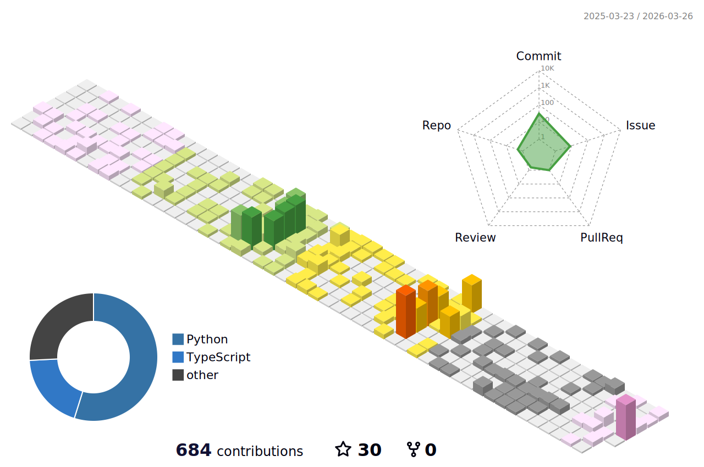

<!-- Capsule Render Header -->

<!-- Profile views -->

  
  

<!-- Typing SVG -->

  

 

<table>
  <tr>
    <td></td>
    <td>

## About Me

🚀 Data & ML practitioner with **3+ years** of experience in analytics, machine learning research, and production ML pipelines.

🤖 I design ML systems that are reliable, observable, and deliver business impact — cloud-based pipelines, well-tested models for churn and risk, and dashboards that push insights to decision-makers.

📊 I work across **Python, SQL, Docker/Podman, Apache Airflow, and cloud platforms**, with a strong focus on experiment tracking and model evaluation for predictive analytics.

💡 Open to **ML System Design, MLOps, and Cloud-Native Predictive Analytics** roles.

  </tr>
</table>

---
<!--
## 💼 Experience

**🟢 Machine Learning Specialist** — *Florida Gulf Coast University* (Apr 2025 – Present)
- Architected end-to-end predictive analytics pipelines with Podman/Docker and Apache Airflow on 100k+ historical records
- Tuned CatBoost + Optuna classification models achieving **80%+ accuracy** and **10–15% performance gains** for churn/risk prediction
- Integrated predictions into Oracle DB and reporting workflows, enabling self-serve dashboards for non-technical stakeholders

**🟢 Graduate Research Assistant — ML & GIS** — *Carl Vinson Institute of Government, UGA* (Aug 2023 – Dec 2024)
- Built deep learning models (Mask R-CNN, Res2UNet, SegFormer) for satellite building damage detection; peak AP of **0.8757**
- Engineered end-to-end ML pipeline on A100-powered HPC cluster with Neptune experiment tracking
- Developed Leaflet-app: an interactive web tool for real-time ACLED conflict data visualization with GitLab CI/CD

**🟢 Graduate Student Researcher** — *University of Georgia* (Aug 2023 – Dec 2024)
- Led MS Research on multivariate time-series forecasting of traffic flow using 100+ California PeMS sensors
- Achieved LSTM top performance: **MAE ~7.9, R² ~0.99** on traffic flow prediction

**🟢 Graduate Teaching Assistant** — *University of Georgia* (Aug 2022 – May 2023)
- Mentored **150+ students** in Data Science and Discrete Mathematics; contributed to a **35% increase** in high-quality project submissions
- Led project-based labs in Python, Java, and C++ with a **95% course-completion rate**

**🟢 Data Analyst (Intern)** — *Bro Services* (Apr 2021 – Oct 2021)
- Built cloud-based ETL pipelines on AWS, cutting reporting latency by ~50% and improving forecasting accuracy by ~20%
- Designed Power BI dashboards with DAX/SQL/Python, driving ~25–35% improvements in conversion and BI adoption

---
-->
## 🎓 Education

| Degree | Institution | Details |
|---|---|---|
| **MS, Computer Science** | University of Georgia | Full tuition waiver via Teaching & Research Assistantship |
| **BE, Computer Engineering** | Pune University | First class with Distinction & Honors in Data Science |

---

## 🛠️ My Tech Stack

### 👨‍💻 Languages

### 🤖 ML / AI / Data Science

  
  
  
  
  
  

### ☁️ MLOps & Cloud

  
  
  

### 🗄️ Databases

  

### 📊 BI & Visualization

  
  
  
  

### 💻 Tools & IDEs

---
<!--
## 🏆 GitHub Trophies

  

---
-->
## 📊 GitHub Stats

  
  

  

---

## 🐍 Contribution Snake

  

---
<!--
## 📊 3D Contribution Graph

  

---

## 📈 GitHub Activity Graph

  

---

## 📌 Featured Projects

| Project | Description | Skills |
|---|---|---|
| **Student Churn & Risk Prediction** | CatBoost + Optuna pipelines on 100k+ records via Airflow/Docker at FGCU | MLOps, CatBoost, Airflow |
| **Traffic Flow Forecasting** | Multivariate LSTM on 100+ CA PeMS sensors (MAE ~7.9, R² ~0.99) | LSTM, Time Series, PeMS |
| **Satellite Damage Detection** | Mask R-CNN/SegFormer on Maxar imagery for 2023 Morocco earthquake (AP 0.8757) | Computer Vision, Deep Learning |
| **World Population & Building Density Map** | Interactive heatmaps using Mapbox & Turf.js | GIS, JavaScript, Mapbox |
| **HR Analytics Dashboard** | Power BI dashboard for employee attrition & salary analytics | Power BI, DAX, SQL |

---
-->
## 🤝 Connect with Me

  
  
  
  
  
  

<!-- Capsule Render Footer -->

<!-- Updated 2026 -->
